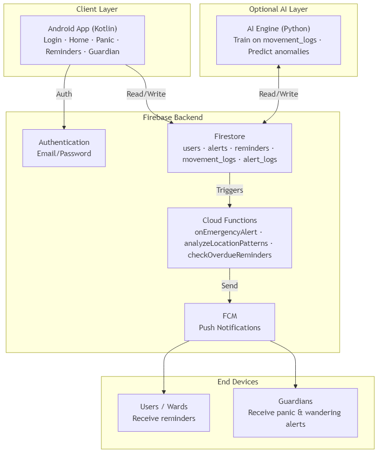
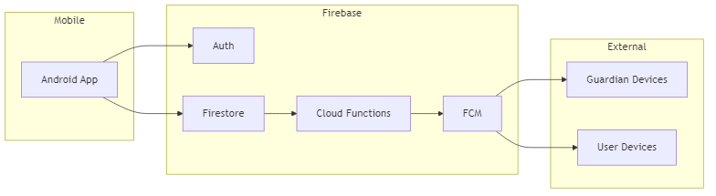
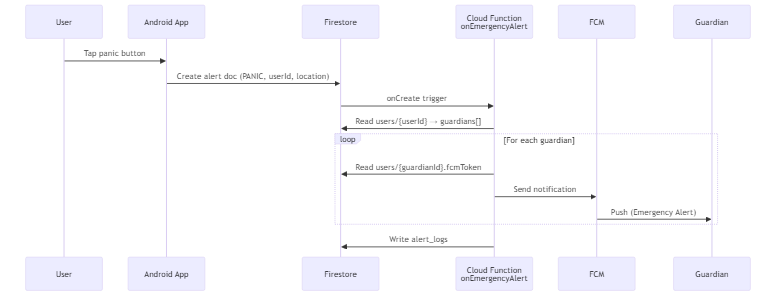
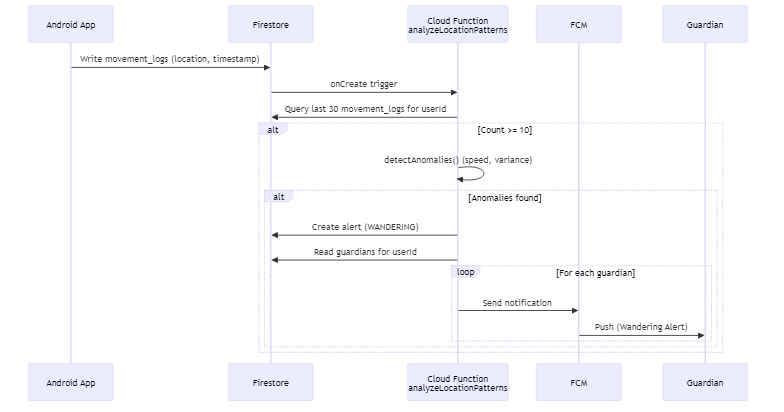
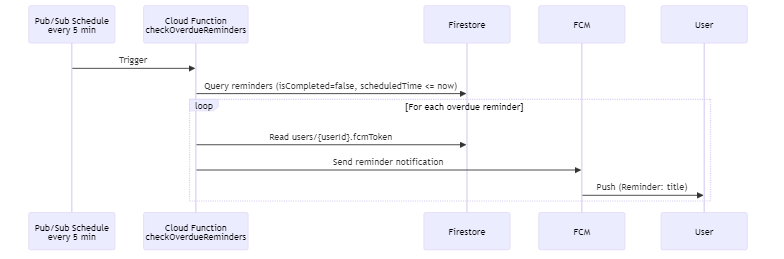
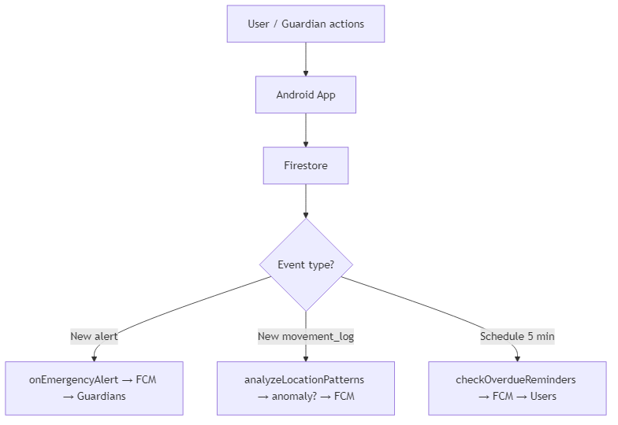

# ZoneZap – Project Report  
## Academic Documentation (~20 Pages)

**School of Management Studies, Vels University (VISTAS)**  
**Project – Shiv**

---

# INDEX

| No. | Section | Page |
|-----|---------|------|
| 1 | Information About The Project | 1 |
| 2 | Abstract | 3 |
| 3 | System Configuration | 4 |
| 3.1 | Hardware Specification | 4 |
| 3.2 | Software Specification | 5 |
| 4 | Project Description | 6 |
| 5 | System Design | 10 |
| 5.1 | Process Flow Diagram | 11 |
| 6 | Sample Codes | 13 |
| 7 | Screen Layouts | 17 |
| 8 | Future Enhancement | 19 |
| 9 | Bibliography | 20 |

---

# 1. INFORMATION ABOUT THE PROJECT

## 1.1 Project Title
**ZoneZap** – Safety and Care Management Application

## 1.2 Domain
Mobile Application Development, Cloud Computing, Internet of Things (IoT), Machine Learning (Anomaly Detection), and Healthcare / Care Management.

## 1.3 Overview
ZoneZap is a safety and care management system designed to support two primary user types:

- **Users (wards):** Individuals who require oversight—such as elderly persons or those with cognitive or mobility considerations. They use the application to log location, receive reminders, and send emergency (panic) alerts.
- **Guardians:** Family members or carers who monitor one or more users. They receive panic and wandering alerts, can add reminders for wards, and view ward status through a dedicated guardian interface.

The system combines an Android mobile application (Kotlin), a Firebase backend (Authentication, Firestore, Cloud Functions), and an optional Python-based AI engine for anomaly detection on movement data. The architecture is cloud-centric: the mobile app communicates with Firebase for authentication and data storage; Cloud Functions react to events (e.g., new alerts, new location logs, scheduled reminder checks) and send push notifications via Firebase Cloud Messaging (FCM) to guardians or users as appropriate.

## 1.4 Objectives
- Provide a secure, role-based (User vs Guardian) authentication and data access model.
- Enable real-time location logging and storage for users, with optional background tracking.
- Support immediate emergency (panic) alerts with automatic notification to all linked guardians.
- Detect potential wandering behavior by analyzing recent movement patterns (speed and variance) and generate WANDERING alerts with guardian notification.
- Allow creation and management of reminders (by users or guardians for wards) with scheduled push notifications for overdue reminders.
- Support guardian–ward linking by email so guardians can add users and manage their reminders and view relevant alerts.
- Optionally integrate an AI engine (Isolation Forest) for training and prediction on movement data to enhance or complement rule-based anomaly detection.

## 1.5 Scope
- **In scope:** Android app (User and Guardian flows), Firebase backend (Auth, Firestore, Cloud Functions), Firestore security rules, FCM notifications, movement logging, panic alerts, wandering detection, reminders with overdue notifications, guardian–ward management, and optional AI training/prediction scripts.
- **Out of scope:** iOS app, web dashboard, offline-first sync, and integration with third-party emergency services (e.g., direct 911/ambulance calls).

## 1.6 Relevance
The project is relevant to mobile development, cloud services (Firebase), event-driven serverless functions, location-based services, and caregiving/healthtech applications. It demonstrates end-to-end design from mobile UI to cloud logic and optional ML components.

---

# 2. ABSTRACT

ZoneZap is a safety and care management application built for users who need oversight (wards) and their guardians. The system offers email/password authentication with two modes—User and Guardian—and uses Firebase (Authentication, Firestore, Cloud Functions) as the backend. The Android application, developed in Kotlin, allows users to log location, trigger panic alerts, and manage reminders; guardians can link wards by email, create reminders for them, and receive real-time notifications for panic and wandering alerts.

Location data is stored in Firestore as movement logs. A Cloud Function analyzes recent movement (e.g., last 30 logs) to detect anomalies such as high average speed or erratic movement variance; when detected, it creates a WANDERING alert and notifies all guardians via FCM. Panic alerts created by the app trigger another Cloud Function that notifies every linked guardian. A scheduled function runs every five minutes to find overdue reminders and send FCM notifications to the respective users.

An optional Python-based AI engine uses scikit-learn’s Isolation Forest to train on movement data from Firestore and can produce anomaly scores for prediction, complementing or potentially replacing the in-Cloud rule-based detection. Security is enforced through Firestore rules so that users can only create alerts and movement logs for themselves, and guardians can read data only for their linked wards.

This report documents the project’s information, abstract, system configuration (hardware and software), project description, system design with process flow diagrams, sample code, screen layouts, future enhancements, and bibliography, serving as a complete reference for understanding and extending the ZoneZap system.

---

# 3. SYSTEM CONFIGURATION

## 3.1 Hardware Specification

The following hardware specifications are recommended for development and running the ZoneZap project components.

| Component | Minimum / Recommended | Notes |
|-----------|------------------------|--------|
| **Processor** | Multi-core CPU (e.g., Intel i5 / AMD Ryzen 5 or equivalent) | For Android Studio, Node.js, and Python ML scripts |
| **RAM** | 8 GB minimum; 16 GB recommended | Android emulator and IDE are memory-intensive |
| **Storage** | 10 GB free (SSD recommended) | For SDKs, emulator images, node_modules, and Python env |
| **Display** | 1280×720 or higher | For IDE and emulator |
| **Network** | Stable internet | Firebase, npm, and Gradle require connectivity |
| **Android device / emulator** | ARM or x86; Android 6.0+ (API 23+) | For testing the mobile app; physical device recommended for location and FCM |
| **GPS / Location** | Supported on device or emulator | Required for location logging and panic alerts with coordinates |

For deployment, the backend runs entirely on Google Firebase (serverless); no dedicated server hardware is required. The AI engine runs on the developer’s machine or any machine with Python 3.9+ and sufficient memory for training (typically 4 GB+ RAM for moderate-sized datasets).

## 3.2 Software Specification

| Category | Software | Version / Notes |
|----------|----------|------------------|
| **Operating system** | Windows 10/11, macOS, or Linux | 64-bit |
| **Runtime** | Node.js | 18 or higher (for Cloud Functions) |
| **Package manager** | npm | Bundled with Node.js |
| **Firebase** | Firebase CLI (`firebase-tools`) | Latest; install via `npm install -g firebase-tools` |
| **Mobile development** | Android Studio | Hedgehog or newer; includes JDK 17 |
| **Language (mobile)** | Kotlin | 1.8+ (as per project Gradle config) |
| **Language (backend)** | JavaScript (Node.js) | ES2020+ (Cloud Functions) |
| **Language (AI)** | Python | 3.9 or higher |
| **Python packages** | scikit-learn, pandas, firebase-admin, etc. | See `ai-engine/requirements.txt` |
| **Version control** | Git | Optional but recommended |
| **Firebase services** | Authentication (Email/Password), Firestore, Cloud Functions, FCM | Enabled in Firebase project; Blaze plan required for Cloud Functions |

**Development tools:** Android Studio for the mobile app; any text editor or IDE for backend (e.g., VS Code) and Python scripts. Firebase Console is used for project setup, Auth, Firestore, and service account keys. The project uses `google-services.json` in the Android app and a service account JSON key in the AI engine directory; these files are not committed to version control.

---

# 4. PROJECT DESCRIPTION

## 4.1 Introduction
ZoneZap integrates a native Android application with a Firebase backend and an optional AI layer to deliver safety and care management. The application supports two distinct roles—User (ward) and Guardian—with separate flows and permissions enforced at the database and application layers.

## 4.2 Problem Statement
Caregivers often need to monitor the safety and whereabouts of dependents (e.g., elderly or cognitively impaired individuals) without being physically present. Manual check-ins are insufficient for emergencies or sudden wandering. There is a need for a system that (1) allows dependents to trigger an emergency alert easily, (2) records location for later analysis, (3) automatically detects possible wandering behavior, and (4) delivers reminders and notifications in a timely manner to both the ward and the guardian.

## 4.3 Proposed Solution
ZoneZap addresses this by:

1. **Dual-role authentication:** Users sign in as either “User” or “Guardian,” and the app and Firestore rules enforce access accordingly.
2. **Panic alerts:** A single tap creates an alert in Firestore; a Cloud Function sends FCM notifications to all guardians linked to that user.
3. **Location logging:** The app periodically records the user’s location to Firestore (`movement_logs`). A Cloud Function analyzes the last 30 entries for anomalies (e.g., high speed or high variance in step distances) and creates WANDERING alerts when thresholds are exceeded, notifying guardians.
4. **Reminders:** Users and guardians can create reminders with a scheduled time. A scheduled Cloud Function runs every 5 minutes, finds overdue reminders, and sends FCM to the corresponding user.
5. **Guardian–ward linking:** Guardians add wards by email; the app looks up the user document and updates both the ward’s `guardians` array and the guardian’s `wards` array in Firestore.
6. **Optional AI engine:** A Python service trains an Isolation Forest model on `movement_logs` and can output anomaly scores, enabling future enhancement of the detection logic.

## 4.4 Features Summary

| Feature | Description |
|--------|-------------|
| **Authentication** | Email/password sign-in with User or Guardian mode. |
| **Location tracking** | App records user location and writes to Firestore `movement_logs`. |
| **Panic alert** | User triggers alert → document in `alerts` → Cloud Function notifies all guardians via FCM. |
| **Wandering detection** | Cloud Function analyzes recent `movement_logs`; creates WANDERING alert and notifies guardians on anomaly. |
| **Reminders** | Create/list/complete reminders; scheduled function sends FCM for overdue reminders. |
| **Guardian–ward link** | Guardian adds ward by email; `users.guardians` and `users.wards` updated. |
| **AI engine** | Python scripts to train and predict anomalies from Firestore movement data. |

## 4.5 Data Model (Firestore)

- **users:** Document ID = Firebase Auth UID. Fields: userId, email, name, type ("user" | "guardian"), guardians (array, for users), wards (array, for guardians), fcmToken, createdAt, updatedAt.
- **alerts:** userId, alertType (e.g. PANIC, WANDERING), level, location (map), timestamp, status, anomalies (optional).
- **reminders:** userId, title, description, scheduledTime, type, isCompleted, createdBy/guardianId, and audit timestamps.
- **movement_logs:** userId, latitude, longitude, timestamp, speed, heading, accuracy.
- **alert_logs:** Written only by Cloud Functions; client access denied by rules.

## 4.6 User Roles

- **User (ward):** type "user"; has `guardians` array; uses Home (location, reminders, panic), Reminders, and Panic screens; can receive reminders created by guardians.
- **Guardian:** type "guardian"; has `wards` array; uses Guardian screen to add wards, view wards, create reminders for wards, and receive panic/wandering FCM notifications.

Linking is implemented by updating both `users/{wardId}.guardians` and `users/{guardianId}.wards` when a guardian adds a ward by email.

## 4.7 Main User Flows (Summary)

- **Sign up / Login:** User selects User or Guardian mode, signs up or logs in; UserService creates/updates `users/{uid}`; app navigates to HomeActivity (user) or GuardianActivity (guardian).
- **Panic alert:** User taps panic → EmergencyService writes to `alerts` → onEmergencyAlert Cloud Function sends FCM to all guardians.
- **Location and wandering:** App writes to `movement_logs`; analyzeLocationPatterns Cloud Function runs on each new log, loads last 30 logs, runs detectAnomalies(); if anomalies exist, creates WANDERING alert and notifies guardians.
- **Reminders:** RemindersActivity and Guardian screen use ReminderService for CRUD; checkOverdueReminders (scheduled every 5 minutes) queries overdue reminders and sends FCM to users.
- **Guardian adds ward:** Guardian enters email; UserService finds user by email and updates both users’ documents to link guardian and ward.

---

# 5. SYSTEM DESIGN

## 5.1 High-Level Architecture

The system consists of:

1. **Android app (Kotlin):** Login, Home, Panic, Reminders, and Guardian activities; services for User, Location, Emergency, Reminder, and WardLocation; data models (Reminder, EmergencyAlert, LocationData).
2. **Firebase:** Authentication (Email/Password), Firestore (users, alerts, reminders, movement_logs, alert_logs), Cloud Functions (onEmergencyAlert, analyzeLocationPatterns, checkOverdueReminders), and FCM for push notifications.
3. **AI engine (optional):** Python scripts that use Firebase Admin to read `movement_logs`, train an Isolation Forest model, and optionally predict anomalies.

Data flow: The app authenticates with Firebase Auth and reads/writes Firestore according to security rules. Cloud Functions react to Firestore events (document creation) or a schedule (reminders); they send FCM messages to the appropriate devices. The AI engine reads from Firestore (and optionally writes predictions) and is independent of the real-time Cloud Function pipeline unless explicitly integrated.

## 5.2 Process Flow Diagram

### High-level architecture




*Figure: ZoneZap high-level architecture – Client, Firebase, AI, and end devices.*


### Component diagram (alternative view)




*Figure: Component diagram – Mobile app, Firebase services, and external devices.*


### Process flow: Panic alert (sequence diagram)




*Figure: Process flow – Panic alert (User → App → Firestore → Cloud Function → FCM → Guardians).*


### Process flow: Wandering detection (sequence diagram)




*Figure: Process flow – Wandering detection (movement_logs → analysis → alert → FCM).*


### Process flow: Overdue reminders (sequence diagram)




*Figure: Process flow – Overdue reminders (scheduler → Cloud Function → FCM → Users).*


### Data flow summary (flowchart)




*Figure: Data flow summary – Event types and Cloud Function responses.*


### Process flow: Panic alert (text)
1. User taps panic in the app.  
2. App (EmergencyService) writes a new document to `alerts` with alertType "PANIC", userId, location, timestamp, status "ACTIVE".  
3. Cloud Function `onEmergencyAlert` (Firestore onCreate) runs.  
4. Function reads `users/{userId}` and gets `guardians`.  
5. For each guardian, reads `users/{guardianId}.fcmToken` and sends FCM message.  
6. Function writes to `alert_logs` for analytics.

### Process flow: Wandering detection
1. App writes a new document to `movement_logs` (userId, lat, lng, timestamp, etc.).  
2. Cloud Function `analyzeLocationPatterns` (Firestore onCreate) runs.  
3. Function queries last 30 `movement_logs` for that userId.  
4. If count ≥ 10, runs `detectAnomalies(locations)` (e.g., avg speed > 5 m/s or variance > 10000).  
5. If anomalies found, creates document in `alerts` with alertType "WANDERING" and notifies guardians (same pattern as panic).

### Process flow: Overdue reminders
1. Scheduled trigger runs every 5 minutes.  
2. `checkOverdueReminders` queries `reminders` where isCompleted == false and scheduledTime <= now.  
3. For each reminder, gets `users/{userId}.fcmToken` and sends FCM to the user.

---

# 6. SAMPLE CODES

## 6.1 Backend – Cloud Function: Emergency Alert Handler

When a new document is created in `alerts`, this function notifies all guardians of the user.

```javascript
exports.onEmergencyAlert = functions.firestore
  .document("alerts/{alertId}")
  .onCreate(async (snap, context) => {
    const alertData = snap.data();
    const alertId = context.params.alertId;

    const userDoc = await admin.firestore()
      .collection("users")
      .doc(alertData.userId)
      .get();

    if (!userDoc.exists) return;

    const userData = userDoc.data();
    const guardians = userData.guardians || [];

    const notificationPromises = guardians.map(async (guardianId) => {
      const guardianDoc = await admin.firestore()
        .collection("users")
        .doc(guardianId)
        .get();

      if (guardianDoc.exists) {
        const fcmToken = guardianDoc.data().fcmToken;
        if (fcmToken) {
          await admin.messaging().send({
            notification: {
              title: `Emergency Alert: ${alertData.alertType}`,
              body: `${userData.name || "User"} needs immediate assistance`,
            },
            data: {
              alertId, userId: alertData.userId, alertType: alertData.alertType,
              latitude: String(alertData.location?.latitude ?? ""),
              longitude: String(alertData.location?.longitude ?? ""),
              timestamp: String(alertData.timestamp?.toMillis?.() ?? ""),
            },
            token: fcmToken,
            android: { priority: "high" },
          });
        }
      }
    });

    await Promise.all(notificationPromises);

    await admin.firestore().collection("alert_logs").add({
      alertId, userId: alertData.userId, alertType: alertData.alertType,
      timestamp: admin.firestore.FieldValue.serverTimestamp(),
      guardiansNotified: guardians.length,
    });

    return { success: true, guardiansNotified: guardians.length };
  });
```

## 6.2 Backend – Anomaly Detection (Movement Analysis)

In-memory anomaly detection used by the Cloud Function:

```javascript
function detectAnomalies(locations) {
  const anomalies = [];
  if (locations.length < 2) return anomalies;

  let totalDistance = 0, totalTime = 0;
  for (let i = 1; i < locations.length; i++) {
    const prev = locations[i - 1], curr = locations[i];
    const distance = calculateDistance(prev.lat, prev.lng, curr.lat, curr.lng);
    const timeDiff = curr.timestamp.toMillis() - prev.timestamp.toMillis();
    const speed = distance / (timeDiff / 1000);
    totalDistance += distance;
    totalTime += timeDiff;
  }
  const avgSpeed = totalDistance / (totalTime / 1000);

  if (avgSpeed > 5) {
    anomalies.push({ type: "HIGH_SPEED", value: avgSpeed, threshold: 5 });
  }

  const distances = [];
  for (let i = 1; i < locations.length; i++) {
    distances.push(calculateDistance(
      locations[i - 1].lat, locations[i - 1].lng,
      locations[i].lat, locations[i].lng
    ));
  }
  const avgDistance = distances.reduce((a, b) => a + b, 0) / distances.length;
  const variance = distances.reduce((s, d) => s + Math.pow(d - avgDistance, 2), 0) / distances.length;
  if (variance > 10000) {
    anomalies.push({ type: "ERRATIC_MOVEMENT", variance });
  }

  return anomalies;
}

function calculateDistance(lat1, lon1, lat2, lon2) {
  const R = 6371000;
  const dLat = toRadians(lat2 - lat1), dLon = toRadians(lon2 - lon1);
  const a = Math.sin(dLat/2)**2 + Math.cos(toRadians(lat1)) * Math.cos(toRadians(lat2)) * Math.sin(dLon/2)**2;
  const c = 2 * Math.atan2(Math.sqrt(a), Math.sqrt(1 - a));
  return R * c;
}
function toRadians(deg) { return deg * (Math.PI / 180); }
```

## 6.3 Mobile App – Sending Emergency Alert (Kotlin)

```kotlin
suspend fun sendEmergencyAlert(
    userId: String,
    alertType: String = "PANIC",
    location: LocationData?,
    additionalData: Map<String, Any> = emptyMap()
): String {
    val alertData = hashMapOf<String, Any>(
        "userId" to userId,
        "alertType" to alertType,
        "level" to "CRITICAL",
        "timestamp" to Timestamp.now(),
        "status" to "ACTIVE"
    )
    location?.let {
        alertData["location"] = hashMapOf(
            "latitude" to it.latitude,
            "longitude" to it.longitude,
            "accuracy" to it.accuracy
        )
    }
    additionalData.forEach { (k, v) -> alertData[k] = v }
    val alertRef = firestore.collection("alerts").add(alertData).await()
    return alertRef.id
}
```

## 6.4 Mobile App – Reminder Data Class and Firestore Mapping

```kotlin
data class Reminder(
    val id: String = "",
    val userId: String = "",
    val title: String = "",
    val description: String = "",
    val scheduledTime: Timestamp? = null,
    val type: String = "GENERAL",
    val isCompleted: Boolean = false,
    val createdBy: String? = null,
    val guardianId: String? = null,
    val wardId: String? = null,
    val createdAt: Timestamp? = null,
    val updatedAt: Timestamp? = null,
    val completedAt: Timestamp? = null,
    val deletedAt: Timestamp? = null
) {
    companion object {
        fun fromDocument(doc: DocumentSnapshot): Reminder = Reminder(
            id = doc.id,
            userId = doc.getString("userId") ?: "",
            title = doc.getString("title") ?: "",
            description = doc.getString("description") ?: "",
            scheduledTime = doc.getTimestamp("scheduledTime"),
            type = doc.getString("type") ?: "GENERAL",
            isCompleted = doc.getBoolean("isCompleted") ?: false,
            createdBy = doc.getString("createdBy"),
            guardianId = doc.getString("guardianId"),
            wardId = doc.getString("wardId"),
            createdAt = doc.getTimestamp("createdAt"),
            updatedAt = doc.getTimestamp("updatedAt"),
            completedAt = doc.getTimestamp("completedAt"),
            deletedAt = doc.getTimestamp("deletedAt")
        )
    }
}
```

## 6.5 Firestore Security Rules (Excerpt – Alerts)

```javascript
match /alerts/{alertId} {
  allow get: if request.auth != null && (
    resource.data.userId == request.auth.uid ||
    (exists(/databases/$(database)/documents/users/$(resource.data.userId)) &&
     request.auth.uid in get(.../users/$(resource.data.userId)).data.guardians)
  );
  allow list: if request.auth != null;
  allow create: if request.auth != null && request.resource.data.userId == request.auth.uid;
  allow update: if request.auth != null && (
    resource.data.userId == request.auth.uid ||
    (request.auth.uid in get(.../users/$(resource.data.userId)).data.guardians)
  );
}
```

## 6.6 AI Engine – Firebase Initialization and Data Fetch (Python)

```python
def initialize_firebase(cred_path=None):
    try:
        if not firebase_admin._apps:
            if cred_path and os.path.exists(cred_path):
                cred = credentials.Certificate(cred_path)
                firebase_admin.initialize_app(cred)
            else:
                firebase_admin.initialize_app()
        return firestore.client()
    except Exception as e:
        print(f"Firebase initialization failed: {e}")
        return None

# Fetch movement_logs from Firestore
query = db.collection('movement_logs').where('userId', '==', user_id)\
    .order_by('timestamp', direction=firestore.Query.DESCENDING).limit(limit)
records = [doc.to_dict() for doc in query.stream()]
```

---

# 7. SCREEN LAYOUTS

## 7.1 Login Screen (LoginActivity)
- **Purpose:** Entry point; sign in / sign up; choose User or Guardian mode via toggles or buttons.
- **Elements:** Email and password fields; mode selector (User / Guardian); Sign In and Sign Up actions; optional error message area.
- **Navigation:** On success, user is directed to HomeActivity (User) or GuardianActivity (Guardian).

## 7.2 Home Screen (HomeActivity)
- **Purpose:** User dashboard.
- **Elements:** Current location display (map or text); list or cards of recent reminders; prominent panic button; FAB or button to open Reminders screen; optional menu for profile or logout.
- **Navigation:** FAB → RemindersActivity; Panic button may open PanicActivity or trigger alert directly.

## 7.3 Panic Screen (PanicActivity)
- **Purpose:** Dedicated screen for triggering an emergency alert.
- **Elements:** Large, clearly visible panic button; optional short instruction text; optional confirmation dialog before sending.
- **Action:** On confirm, EmergencyService sends alert to Firestore; Cloud Function notifies guardians.

## 7.4 Reminders Screen (RemindersActivity)
- **Purpose:** List, create, edit, and complete reminders.
- **Elements:** List (RecyclerView or similar) of reminders with title, description, scheduled time, and completed state; FAB to add reminder; item actions (edit, mark complete, delete); form/dialog for create/edit (title, description, date/time picker).
- **Context:** Used by User for own reminders and by Guardian for a selected ward’s reminders.

## 7.5 Guardian Screen (GuardianActivity)
- **Purpose:** Guardian dashboard.
- **Elements:** List of linked wards (names/emails); “Add ward” flow (email input, search, confirm); option to create reminder for a ward; optional view of ward’s recent alerts or location summary.
- **Navigation:** Add ward → email entry → UserService finds user and links; create reminder → same ReminderService with ward’s userId.

## 7.6 Notifications
- **FCM:** Notifications appear in the system tray (and in-app if handled). Title and body are set by Cloud Functions (e.g., “Emergency Alert: PANIC”, “Reminder: &lt;title&gt;”). Data payload can include alertId, userId, alertType, location, timestamp for the app to open the right screen.

---

# 8. FUTURE ENHANCEMENT

- **iOS application:** Port the same flows (User/Guardian, panic, reminders, guardian–ward link) to iOS using Swift/SwiftUI or a cross-platform framework.
- **Web dashboard:** Admin or guardian web UI to view wards, alerts history, and reminders without opening the mobile app.
- **Offline support:** Cache critical data (e.g., reminders, last known location) and sync when online; queue alerts and movement logs for later write.
- **Geofencing:** Define safe zones (e.g., home, care center); trigger alerts when the user leaves or enters a zone.
- **Richer AI integration:** Call the Python anomaly model from a Cloud Function (e.g., via HTTP or reimplementing the model in Node) for real-time or batch scoring; retrain periodically on new movement data.
- **Multi-language and accessibility:** Localized strings and improved accessibility (TalkBack, larger touch targets) for elderly users.
- **Emergency services integration:** Optional one-tap or automatic escalation to local emergency numbers when a critical alert is not acknowledged.
- **Analytics and reporting:** Dashboards for guardians (e.g., alert frequency, movement summaries) and export of reminder/alert history.

---

# 9. BIBLIOGRAPHY

1. Firebase Documentation. *Firebase Authentication*. https://firebase.google.com/docs/auth  
2. Firebase Documentation. *Cloud Firestore*. https://firebase.google.com/docs/firestore  
3. Firebase Documentation. *Cloud Functions for Firebase*. https://firebase.google.com/docs/functions  
4. Firebase Documentation. *Firebase Cloud Messaging*. https://firebase.google.com/docs/cloud-messaging  
5. Android Developers. *Kotlin for Android*. https://developer.android.com/kotlin  
6. Android Developers. *Location APIs*. https://developer.android.com/training/location  
7. scikit-learn. *Isolation Forest*. https://scikit-learn/stable/modules/generated/sklearn.ensemble.IsolationForest.html  
8. Node.js. *Node.js v18 Documentation*. https://nodejs.org/docs/latest-v18.x/api/  
9. Python Software Foundation. *Python 3.9 Documentation*. https://docs.python.org/3.9/  
10. Vels University (VISTAS). *Project Guidelines and Documentation Standards*. School of Management Studies.

---

**End of Report.**  
For setup and run instructions, refer to **SETUP-OTHER-SYSTEM.md**. For detailed technical documentation, refer to **PROJECT-DOCUMENTATION.md**.
