# ZoneZap — Architecture Diagrams (HLD, LLD, ML)

This document contains **High Level Design (HLD)**, **Low Level Design (LLD)**, and **ML pipeline** diagrams for the ZoneZap project. Diagrams are in Mermaid format and render on GitHub, GitLab, and most Markdown viewers.

---

## Table of contents

1. [HLD — System context](#1-hld--system-context)
2. [HLD — Container diagram](#2-hld--container-diagram)
3. [HLD — Data flow](#3-hld--data-flow)
4. [LLD — Android app components](#4-lld--android-app-components)
5. [LLD — Backend (Cloud Functions)](#5-lld--backend-cloud-functions)
6. [LLD — Sequence: Panic alert](#6-lld--sequence-panic-alert)
7. [LLD — Sequence: Wandering detection](#7-lld--sequence-wandering-detection)
8. [LLD — Sequence: Overdue reminders](#8-lld--sequence-overdue-reminders)
9. [LLD — Firestore data model](#9-lld--firestore-data-model)
10. [ML — Training pipeline](#10-ml--training-pipeline)
11. [ML — Prediction pipeline](#11-ml--prediction-pipeline)
12. [ML — Feature flow](#12-ml--feature-flow)

---

## 1. HLD — System context

Shows ZoneZap and its external users/systems.

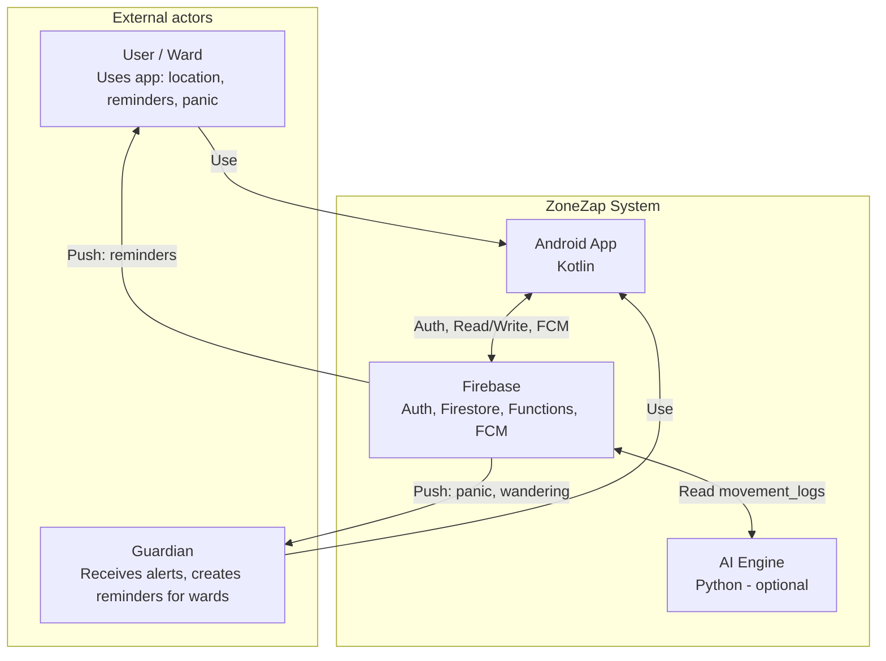

---

## 2. HLD — Container diagram

Main deployable units and how they communicate.

```mermaid
flowchart TB
    subgraph Client["Client Tier"]
        ANDROID["Android App (Kotlin)\n• Login, Home, Panic\n• Reminders, Guardian\n• LocationService, EmergencyService"]
    end

    subgraph Firebase["Firebase (Cloud)"]
        AUTH[Firebase Auth\nEmail/Password]
        FS[(Firestore\nusers, alerts\nreminders\nmovement_logs\nalert_logs)]
        CF[Cloud Functions\nNode.js 18\n• onEmergencyAlert\n• analyzeLocationPatterns\n• checkOverdueReminders]
        FCM[Firebase Cloud\nMessaging]
    end

    subgraph AI["AI Tier (Optional)"]
        PY[Python AI Engine\n• train.py\n• train_with_firebase.py\n• predict.py\nIsolation Forest]
    end

    ANDROID -->|Sign in| AUTH
    ANDROID -->|Read/Write| FS
    ANDROID -->|Receive push| FCM
    FS -->|Triggers| CF
    CF -->|Read users, send push| FS
    CF -->|Send| FCM
    PY -->|Read movement_logs\n(service account)| FS
    PY -.->|Optional: write predictions| FS
```

---

## 3. HLD — Data flow

End-to-end data flow for alerts and location.

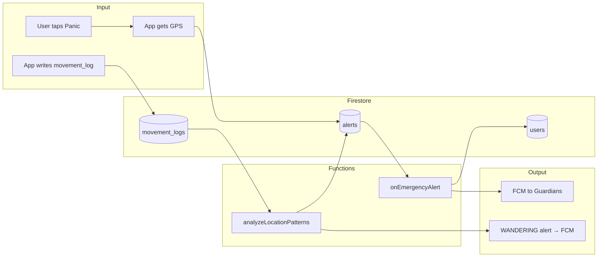

---

## 4. LLD — Android app components

Packages and main classes inside the mobile app.

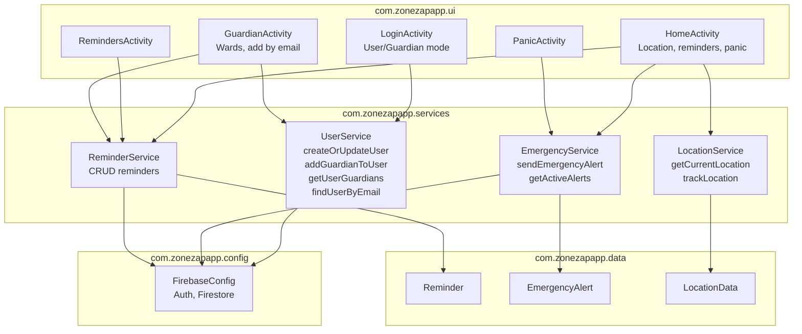

---

## 5. LLD — Backend (Cloud Functions)

Functions, triggers, and internal helpers.

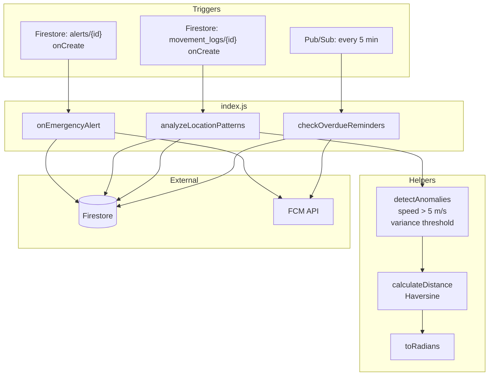

---

## 6. LLD — Sequence: Panic alert

Flow from user tap to guardian notification.

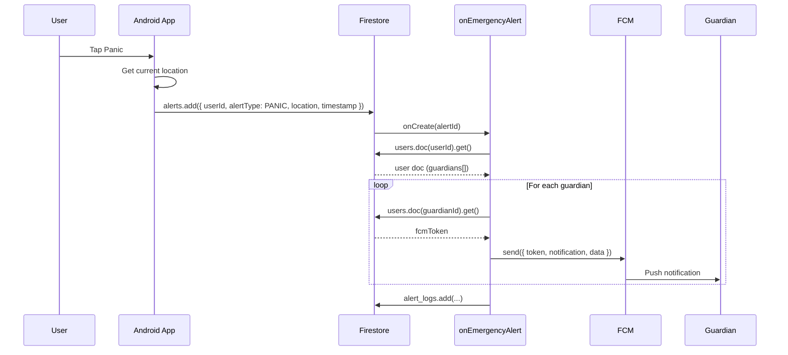

---

## 7. LLD — Sequence: Wandering detection

Flow from new movement_log to guardian notification.

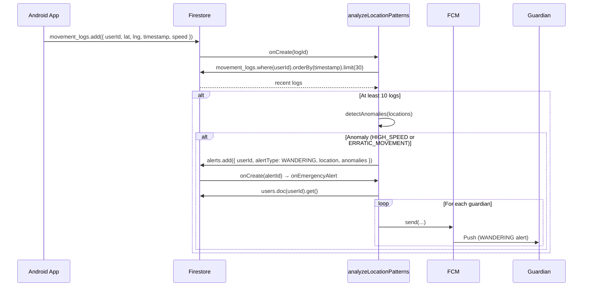

---

## 8. LLD — Sequence: Overdue reminders

Scheduled job and FCM to user.

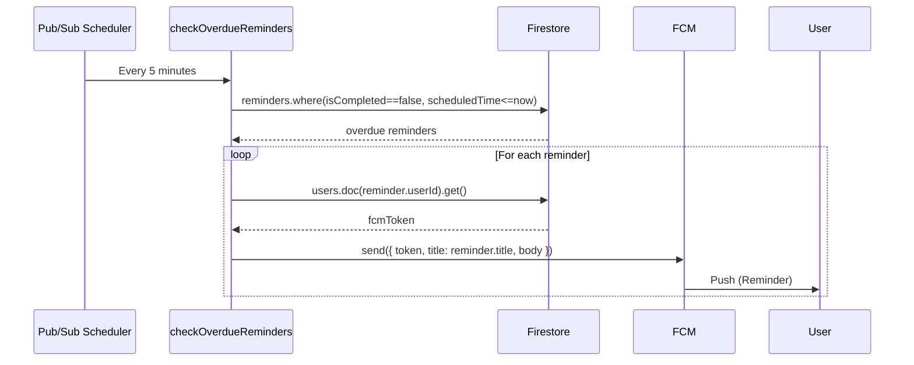

---

## 9. LLD — Firestore data model

Collections and main fields (entity relationship style).

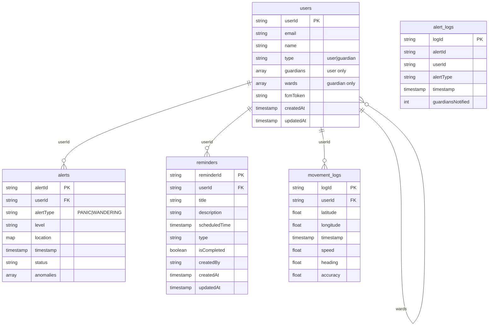

---

## 10. ML — Training pipeline

From raw data to saved model (Python AI engine).

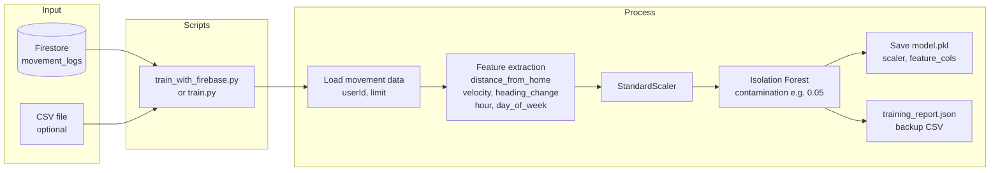

---

## 11. ML — Prediction pipeline

Loading model and scoring new location data.

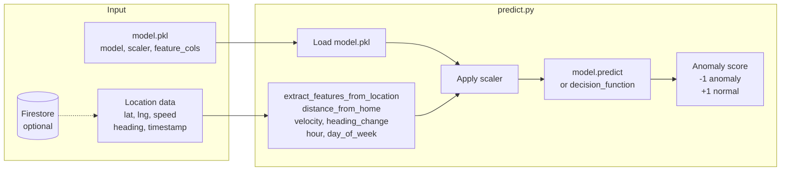

---

## 12. ML — Feature flow

How raw location becomes model input (detailed).

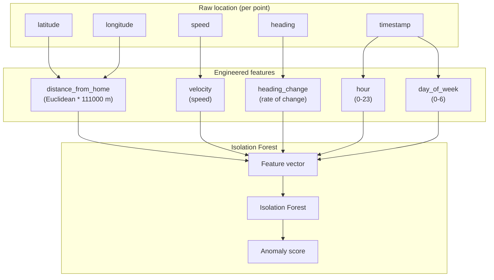

---

## Summary

| Diagram | Purpose |
|--------|----------|
| **HLD Context** | Who uses the system and what the system is |
| **HLD Container** | Main building blocks: Android, Firebase, AI Engine |
| **HLD Data flow** | How data moves for alerts and location |
| **LLD Android** | Activities, services, data classes, config |
| **LLD Backend** | Cloud Functions, triggers, helpers |
| **LLD Sequences** | Panic, wandering, overdue reminders step-by-step |
| **LLD Firestore** | Collections and relationships |
| **ML Training** | Firestore/CSV → features → Isolation Forest → model.pkl |
| **ML Prediction** | model.pkl + location → features → score |
| **ML Features** | Raw fields → engineered features → model input |

To view Mermaid diagrams: open this file in GitHub, GitLab, VS Code (with Mermaid extension), or any Markdown viewer that supports Mermaid.
